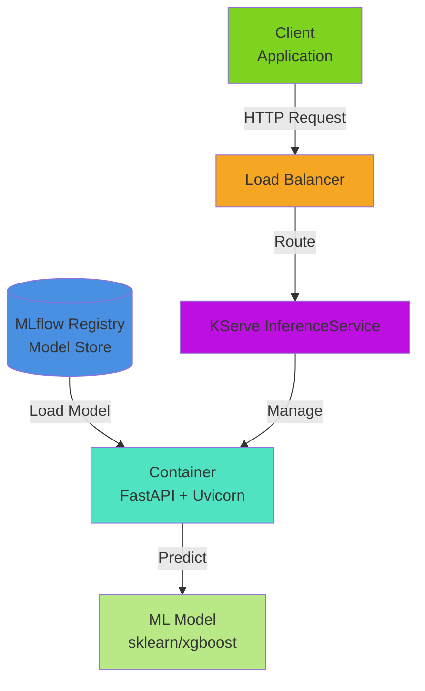
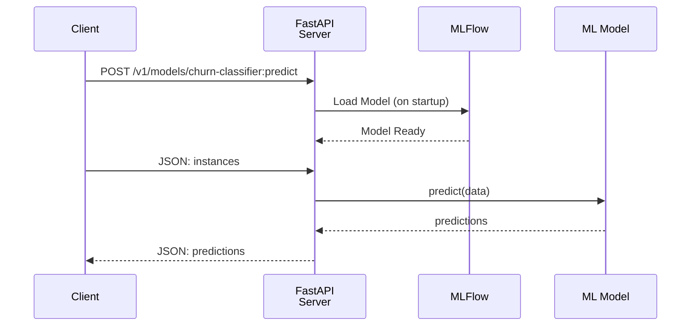
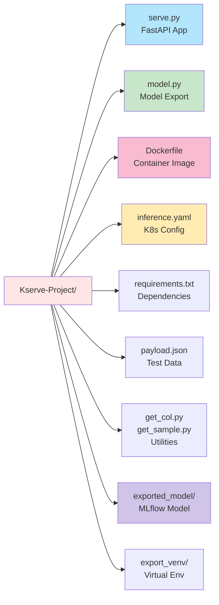
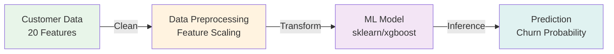

# KServe Churn Classifier 🚀

A production-ready machine learning model serving platform built with **KServe**, **MLflow**, and **FastAPI** for predicting customer churn.

---

## 📋 Table of Contents

- [Overview](#overview)
- [Architecture](#architecture)
- [Project Structure](#project-structure)
- [Quick Start](#quick-start)
- [Usage](#usage)
- [Deployment](#deployment)
- [Model Information](#model-information)
- [API Reference](#api-reference)
- [Contributing](#contributing)

---

## 🎯 Overview

This project provides a containerized ML model serving application that:
- **Pre-Requisite** You should have already experiment tracking on mlflow(could be locally or cloud). If it is in cloud. kindly change the experiment_uri tracking in model.py
- **Loads pre-trained models** from MLflow Model Registry
- **Serves predictions** via REST API using FastAPI
- **Runs on Kubernetes** via KServe InferenceService
- **Scales automatically** with industry-standard MLOps practices

### Key Features
✅ Fast, scalable inference with FastAPI  
✅ Model versioning via MLflow  
✅ Kubernetes-native deployment  
✅ Docker containerization  
✅ RESTful API with health checks  
✅ Production-ready logging  

---

## 🏗️ Architecture

### System Overview



### Request-Response Flow



---

## 📁 Project Structure



---

## 🚀 Quick Start

### 1. **Install Dependencies**

```bash
cd Kserve-Project
pip install -r requirements.txt
```

### 2. **Setup MLflow Connection**

Ensure MLflow server is running:
```bash
mlflow server --port 5000
```

### 3. **Export Model from MLflow**

```bash
python model.py
```

This loads the champion model from MLflow and exports it locally.

### 4. **Run the Server Locally**

```bash
python serve.py
```

Server starts on `http://localhost:8080`

### 5. **Test Prediction**

```bash
curl -X POST http://localhost:8080/v1/models/churn-classifier:predict \
  -H "Content-Type: application/json" \
  -d @payload.json
```

---

## 💡 Usage

### Health Check

```bash
curl http://localhost:8080/health
```

Response:
```json
{"status": "ok"}
```

### Make Predictions

**Endpoint:** `POST /v1/models/churn-classifier:predict`

**Request Format:**
```json
{
  "instances": [
    [
      "customer123",
      "Male",
      0,
      "Yes",
      "No",
      24,
      "Yes",
      "Yes",
      "Fiber optic",
      "Yes",
      "No",
      "Yes",
      "Yes",
      "Yes",
      "No",
      "Month-to-month",
      "Yes",
      "Credit card",
      65.50,
      1570.40
    ]
  ]
}
```

**Response:**
```json
{
  "predictions": [1]
}
```

---

## 🐳 Docker Deployment

### Build Docker Image

```bash
docker build -t churn-classifier:v8 .
```

### Run Container

```bash
docker run -p 8080:8080 \
  -v $(pwd)/exported_model:/mnt/models \
  churn-classifier:v8
```

---

## ☸️ Kubernetes Deployment

### Deploy with KServe

```bash
kubectl apply -f inference.yaml
```

### Monitor Deployment

```bash
kubectl get inferenceservice -n kserve
kubectl logs -f deployment/churn-classifier -n kserve
```

### Make Predictions (Kubernetes)

```bash
kubectl port-forward -n kserve service/churn-classifier 8080:8080
```

Then use the same prediction endpoint.

---

## 📊 Model Information

### Model Details

| Property | Value |
|----------|-------|
| **Name** | kubeflow_churn_classifier |
| **Framework** | scikit-learn / XGBoost |
| **Input Features** | 20 customer attributes |
| **Output** | Binary classification (Churn: 0/1) |
| **Registry** | MLflow Model Registry |
| **Stage** | Champion |

### Input Features

```
customerID, gender, SeniorCitizen, Partner, Dependents,
tenure, PhoneService, MultipleLines, InternetService,
OnlineSecurity, OnlineBackup, DeviceProtection, TechSupport,
StreamingTV, StreamingMovies, Contract, PaperlessBilling,
PaymentMethod, MonthlyCharges, TotalCharges
```

### Model Pipeline



---

## 📡 API Reference

### Endpoints

#### 1. Health Check
- **Method:** `GET`
- **Path:** `/health`
- **Response:** `{"status": "ok"}`

#### 2. Predictions
- **Method:** `POST`
- **Path:** `/v1/models/churn-classifier:predict`
- **Content-Type:** `application/json`
- **Body:** See [Usage](#usage) section

---

## 📚 Utility Scripts

### `get_col.py`
Extracts feature columns from data.

### `get_sample.py`
Generates sample data for testing.

### `model.py`
Exports the champion model from MLflow to local storage.

---

## 🔧 Configuration

### inference.yaml
KServe InferenceService configuration:
- **Image:** `churn-classifier:v8`
- **Port:** `8080`
- **CPU Request:** `100m` / Limit: `500m`
- **Memory Request:** `256Mi` / Limit: `512Mi`

### requirements.txt
Key dependencies:
```
mlflow          - Model registry and tracking
fastapi         - Web framework
uvicorn         - ASGI server
pandas          - Data processing
scikit-learn    - ML framework
xgboost         - Gradient boosting
```

---

## 🐛 Troubleshooting

| Issue | Solution |
|-------|----------|
| Model not found | Ensure MLflow server is running on port 5000 |
| Port 8080 in use | Change port in `serve.py` or stop other services |
| Container fails to start | Check Docker volume mount: `-v $(pwd)/exported_model:/mnt/models` |
| Slow predictions | Verify model is loaded (check logs) |

---

## 📝 License

This project is part of the MLOps Orchestration suite.

---

## 👥 Contributing

1. Create a feature branch
2. Make your changes
3. Test locally
4. Submit a pull request

---

## 📞 Support

For issues or questions, check the logs:
```bash
docker logs <container_id>
# or
kubectl logs -f deployment/churn-classifier -n kserve
```

---

**Last Updated:** June 2026  
**Status:** Production Ready ✅
